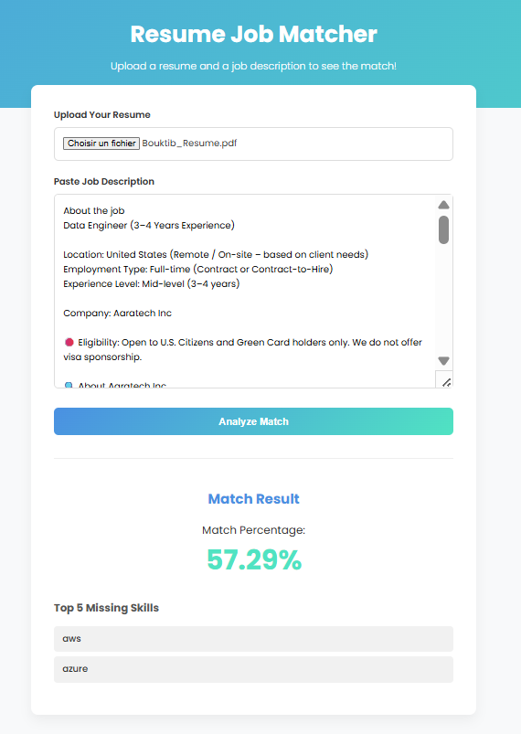

# Job Matcher

This project is a simple web application that matches job descriptions with resumes based on keyword similarity.

## Features

*   Upload a resume (or paste its content).
*   Upload a job description (or paste its content).
*   Get a match score based on common keywords.


## Project Structure

```
job-matcher/
├── backend/
│   └── cloud-function/ # Python backend for resume and job description processing
├── frontend/           # HTML, CSS, and JS for the user interface
├── iac/                # Terraform files for infrastructure deployment
├── keyword-data/       # Data files for keyword extraction
└── cloudbuild.yaml     # Google Cloud Build configuration for CI/CD
```

## Setup and Deployment

1.  **Infrastructure:**
    *   Navigate to the `iac` directory.
    *   Initialize Terraform: `terraform init`
    *   Apply the Terraform configuration: `terraform apply`

2.  **Backend:**
    *   The Cloud Function is deployed automatically via the Terraform script. The source code is in `backend/cloud-function`.

3.  **Frontend:**
    *   The frontend is a simple static website that can be opened directly in a browser or hosted on a web server. It interacts with the deployed Cloud Function.

4.  **CI/CD:**
    *   The `cloudbuild.yaml` file contains the configuration for continuous integration and deployment using Google Cloud Build. You can set up a trigger in your Google Cloud project to automatically build and deploy the application when changes are pushed to your repository.

## Usage

1.  Open the `frontend/index.html` file in your web browser.
2.  Paste the content of a resume in the "Resume" text area.
3.  Paste the content of a job description in the "Job Description" text area.
4.  Click the "Match" button to see the similarity score.

## Screenshot


